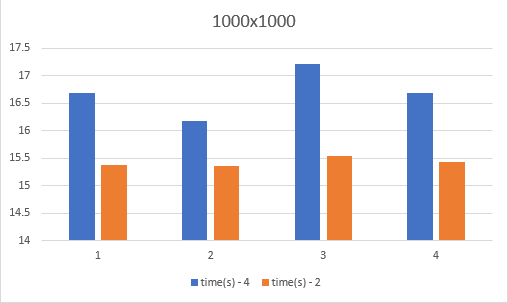
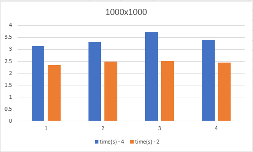
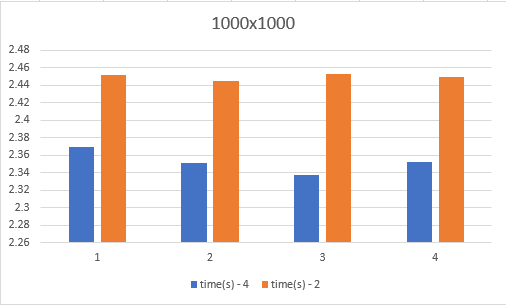
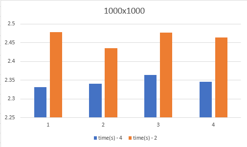
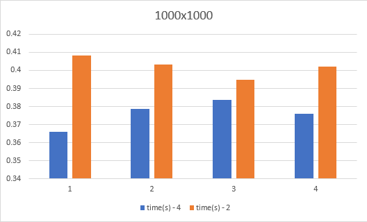
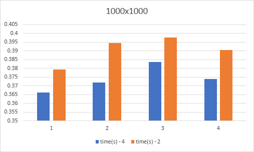

### (3) 1000x1000

    (i) - Native
        a. 4-byte floating point
        b. 2-byte fixed point

<p align="center">  </p>

    (ii) - Multi-threading only (12/12 threads active)
        a. 4-byte floating point
        b. 2-byte fixed point

<p align="center">  </p>

    (iii) - SIMD
        a. 4-byte floating point
        b. 2-byte fixed point

<p align="center">  </p>

    (iv) - SIMD & Cache
        a. 4-byte floating point
        b. 2-byte fixed point

<p align="center">  </p>

    (v) - Multi-threading & SIMD(12/12 threads active)
        a. 4-byte floating point
        b. 2-byte fixed point

<p align="center">  </p>


    (vi) - Multi-threading & Cache(12/12 threads active)
        a. 4-byte floating point
        b. 2-byte fixed point
    
    There isn't much of a difference observed between this case and case (ii) so I will leave out the graph. 

Average time for 4-byte floating-point: ```3.50033``` (s); 2-byte fixed-point: ```2.432``` (s).

    (vii) - All methods
        a. 4-byte floating point
        b. 2-byte fixed point

<p align="center">  </p>

---

#### Overall
Just like with the 500x500 size, it is very clear to see that as we combine the matrix multiplication methods, performance increases drastically. Average execution times are below: 

|Method|Avg. time(s)|
|-----:|----|
|native -4|16.69|
| -2| 15.42|
|Multi -4|3.296|
|-2|2.451|
|SIMD -4| 2.35|
|-2|2.45|
|SIMD/Cache -4|2.345|
|-2|2.463|
|Multi/Cache -4|3.50033|
|-2 | 2.432|
|Multi/SIMD -4|0.3766|
|-2| 0.4022|
|ALL -4|0.3739|
|-2|0.3904|

This data seems to support the idea that the best 1+1 method for matrix-matrix multiplication is Multi-threading that uses SIMD programming as this has the fastest execution time and closely matches the time when all methods are working.
