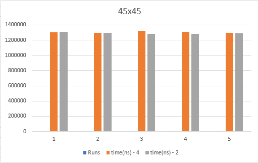
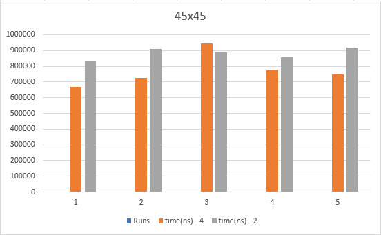

### (1) 45x45

    (i) - Native multiplication
        a. 4-byte floating point
        b. 2-byte fixed point

<p align="center">  </p>

For a matrix this small, the program has no problem performing the matrix multiplication no matter the data type and executes within average time of around ```1300000``` nano seconds or approximately ```.0013``` seconds.

    (ii) - Cache miss optimization and multi-threading (Using 4 threads / 12 available)
        a. 4-byte floating point
        b. 2-byte fixed point

<p align="center">  </p>

By optimizing the cache miss rate and using multi-threads, the average time taken to perform the multiplication decreases to around ```826460``` (ns) or ```.00083``` (s).
