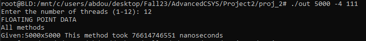
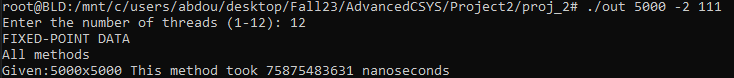

### (4) 5000x5000

For this matrix size, I will just be using all of the methods together.

    (i) - All methods
        a. 4-byte floating point
        b. 2-byte fixed point

<p align="center">  </p>

Execution time on 4-byte floating point data: ```76.61``` (s)

<p align="center">  </p>

Execution time on 2-byte fixed point data: ```75.87``` (s)