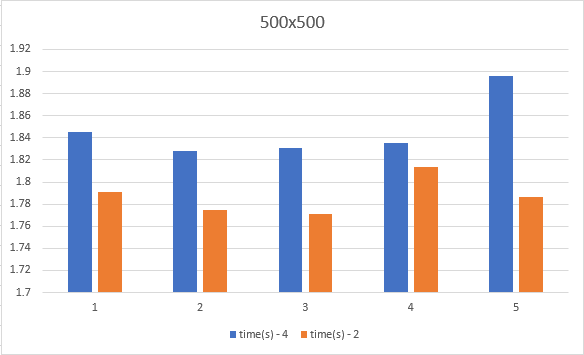
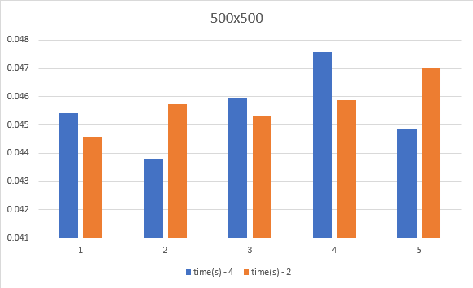

### (2) 500x500

    (i) - Native
        a. 4-byte floating point
        b. 2-byte fixed point

<p align="center">  </p>

As you can see, the program is approaching a bottleneck when it comes to this matrix size as the execution time jumps critically to an average of ```1.85```(s) for -4-byte floating and ```1.78```(s) for 2-byte fixed.

    (ii) - Using all optimization methods(multi-threading (12/12 threads active), simd, cachemiss)
        a. 4-byte floating point
        b. 2-byte fixed point

<p align="center">  </p>

By utilizing all of the methods in conjunction with one another, there is a significant performance increase in comparison to the native method. Average execution times are below:

|Method|Avg. time(s)|
|-----:|----|
|native -4| 1.85|
| -2| 1.78|
|All -4|0.0455|
|-2|0.0456|
