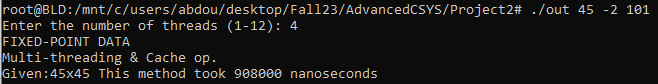
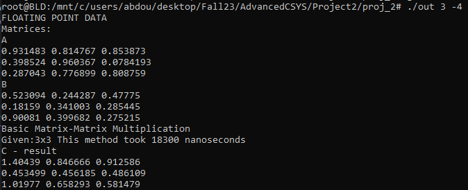

## Matrix-Matrix Multiplication -- User-manual and Program Specifications
The purpose of this program is to perform matrix-matrix multiplication using various methods and compare them to the native implementation of matrix-matrix multiplication.

(i) Multiple threads

(ii) x86 SIMD Instructions

(iii) Cache miss optimization

(iv) All 3 together

(v) Three 1+1 combinations of the 3 techniques

The implementation supports : 

(1) configurable matrix size that can be much larger than the on-chip cache capacity

(2) Both fixed-point and floating-point data 

(3) Moreover, the program allows users to individually turn on/off the three optimization techniques (i.e., multi-threading, SIMD, and cache miss 
minimization) and configure the thread number.

---

### Usage

To keep things simple, there is only one program that integrates all of the desired functionality described above. Among the numerous libraries utilized within, the only one that has a visible effect during compilation is the "immintrin.h" library, provided by Intel for C and C++, which allows the use of Advanced Vector Extensions 2 (AVX2) intrinsics for SIMD based programming.

Using GCC, program can be compiled with:

```
g++ -mavx2 mmm.cpp -o exe
```

The "-mavx2" dialogue lets the compiler know to generate code that leverages AVX2 instructions and is critical for enabling and optimizing the use of AVX2 instructions. Neglecting the flag may lead to errors in program execution.

If you encounter the error 'undefined reference to 'pthread_create', simply add the '-pthread' flag in compilation.

Example:

```
g++ -mavx2 -o exe mmm.cpp -pthread
```

After compiling, the program requires several inputs, which, at capacity, can be mapped to something along the lines of this:

```
./exec matrixSize (Data-Type) (3-bit input string)
```

matrixSize - Some n value that will tell the program what size matrices to create (all matrices will be square)

Data-Type - Specify 4-byte floating-point or 2-byte fixed-point

Flags: ```-4, -2```

The program will populate the matrices with random values depending on the data-type.

3-bit input string - This tells the program what matrix-matrix multiplication method to use. For example, a 3-bit string of '100' will call matrix-matrix multiplication using multi-threading. Each bit represents one of the 3 main methods. So setting the bits high or low, will 'activate' and combine the corresponding methods in the program. If you will:

| Input | Method |
|------:|--------|
| bit[0]|Multi-threading|
| bit[1]|SIMD|
| bit[2]|Cache Miss Optimization|

Putting them all together:

```
./exec 1000 -4 101
```


This specific call, will create matrices of size 1000x1000 with 4-byte floating-point data. Additionally, the multiplication will be a combination of multi-threading and optimizing the cache miss rate.

NOTE:

(1) - An input without the 3-bit string is allowed and will simply perform basic matrix-matrix multiplication with the specified data type

(2) - Setting bit[0] high will prompt the user to sepcify the number of threads to use, which cannot exceed the available CPU cores on the host device

(3) - Setting bit[1] high will trigger a size minimum on the matrixSize of atleast 104. Reason being, SIMD only makes sense to use past a certain matrixSize. In my case, I made the minimum 104. The given matrixSize will also be changed depending on if it is a multiple of 8 which is the 'simd_width' used in the program. This 'simd_width' corresponds to the 256-bit AVX registers in x86 architecture. All of this input handling allows for efficient vectorization and ensures data alignment when accessing data without wasting memory or computational resources.

(4) - Setting bit[2] high will flag the "transpose" condition which then transposes one of the matrices. Matrix transposition improves the cache miss rate in a number of ways including, but not limited to: (1) improved spatial locality, (2) better memory access patterns, and (3) Reduced temporal locality.

---
#### Proof of Concept/Functionality

Example Output:

<p align="center">  </p>

Example Multiplication:

<p align="center">  </p>

If you evaluate the multiplication of the A and B matrices, you will see the correct result matches the output shown in the above image.

---

### Experimental Results

NOTE: Unfortunately, performing the matrix-matrix multiplication on the ```10000X10000``` matrix is not yet viable. The program just runs too long for it to be reasonable. Admittedly, there is a clear bottleneck in what my current implementation can do which I have yet to optimize. The results I will present are as follows:

1) 45x45
2) 500x500
3) 1000x1000
4) 5000x5000
5) 10000x10000
---
#### Realistically, there are 8 different experiment combinations for each matrix size. So 16 experiments to account for both data-types. Then 16 multiplied (5) for the number of different sizes. To limit the length and be concise, I will only display specific interesting cases especially on the ```1000x1000``` case. 

### Please navigate to the "experiments" folder to find the data from the trials.

---

### Conclusion

After completing all of the trials and examining the performance differences, it became clear how important it is to utilize not just one protocol to optimize a program, but multiple in conjuction with one another. By leveraging the strengths of parallelism, efficient data processing, and cache-friendly memory access patterns, program performance improved by at least 1 order of magnitude in almost every trial. This is cemented even more so in this usecase where data can be very large and there are a multitude of factors to consider. 

I found myself asking lots of questions. What libraries are in use? How is data created/accessed? Can this function be faster? How can I remove duplicate code? Constantly, there is an overarching theme of weeding out the overhead in the program and making it better as a whole.

Overall, the experiments prove that combining all the methods yields the best performance.
